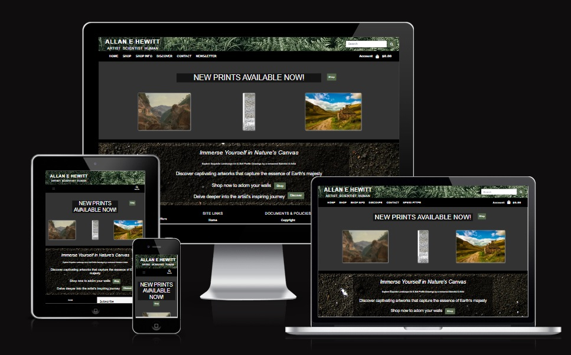
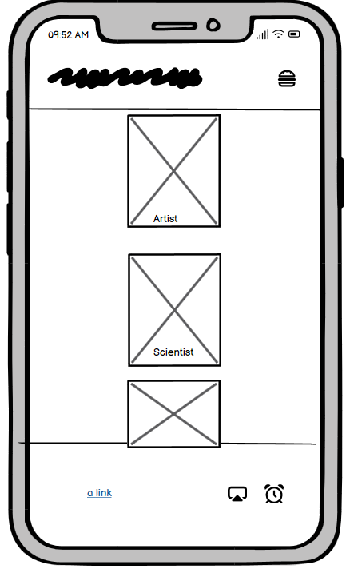

#  AEH Art

Site Link: <a href="https://aya-teen-room-1764987b8851.herokuapp.com/" target="_blank">AEH Art</a>

1. [Introduction](#introduction)
2. [User Experience](#user-experience)
3. [Design](#design)
4. [Project Management](#projectd-management)
5. [Features](#features)
6. [Future Features](#future-features)
7. [Testing](#testing)
    1. [Validator Testing](#validator-testing)
    2. [Manual Testing](#manual-testing)
8. [Bugs](#bugs)
    1. [Known Bugs](#known-bugs)
    2. [Solved Bugs](#solved-bugs)
9. [Deployment](#deployment)
    1. [Github](#github)
    2. [Heroku](#heroku)
10. [Credits](#credits)
    1. [Code Used](#code-used)
    2. [Content](#content)
    3. [Technologies Used](#technologies-used)
11. [Acknowledgements](#acknowledgements)

Site Link: <a href="https://aeh-art-37fc72a61b91.herokuapp.com/" target="_blank">Allan E Hewitt</a>

# INTRODUCTION

Allan E Hewitt Art is an e-commerce website that sells art prints of the artist (Allan E Hewitt).  The artist is a skilled landscape painter and also a well-known soil scientist who creates hand-drawn soil profile pictures.  The website sells examples of the artists oil-based landscape paintings, soil profile drawings, and also other art formats by the artist. The website also showcases the artist's life and work, enabling the user to connect with the artist beyond purchasing his paintings.

The website brief was developed by the Hewitt Family Trust, who wanted a platform to showcase and sell Allan's art, and also to showcase Allan himself - sharing his accomplishments in both art and science with a wider audience.

# User Experience

## Target Audience

The target audience is users who want to purchase art prints.  These users will include landscape art painting enthusiasts, and also members of the science community who have an interest in scientific art and soil sciences.  The site also aims to gain interest from people who want to find out more about Allan E Hewitt's life and achievements.

## Site Aims

* To showcase and sell the artwork of Allan E Hewitt
* To showcase Allan E Hewitt's life

## User Stories

### EPICS:
User stories were broken up into the following epics (each user story was assigned an epic on the site's agile project board).

* Browsing
* Accounts
* Purchasing
* Site Admin
* Contact
* Wishlist
* About

### As a user:
1.  As a user I can view a list of artwork so that I can decide what to buy
2.  As a user I want to view individual art pieces so that I can see the price, artwork details, single image and print size
3.  As a user I want to sort the artwork list by year so that I can see the year of the artwork easily
4.  As a user I want to sort the publications list by title or year so that I can see the publications I'm interested in easily - won't have
5.  As a user I want to sort by category of artwork so that I can find the best-price in a category, or sort the artwork in that category by name
6.  As a user I want to sort multiple categories of products at once so that I can find the best-priced or best-sized product across all categories
7.  As a user I want to search for artwork by name or type so that I can find a specific art piece I want to purchase
8.  As a site user I want to see what I've searched for & the number of results so that I can see if the artwork i want is available
9.  As a user I want to look at a specific category of artwork so that I can easily find artwork that suits me without looking through the entire catalogue
10. As a user I want to signup for an account so that I can have my own account & review my profile
11. As a user I want to login or logout so that I can access my profile and account
12. As a user I want to recover my password in case i forget it so that I can have access to my account at all times
13. As a user I want to be notified after signing up so that I can know that my registration was successful
14. As a user I want to have my own user profile so that I can see my own order history and order confirmations, and save my payment details
15. As a user I want to easily view the sum of my art selections so that I can manage my spending
16. As a user I want to choose the quantity of a print when buying it so that I can ensure i don't accidentally select the wrong values
17. As a user I want to see items in my cart to be purchased so that I can see the total cost of my selections and the artwork I have chosen
18. As a user I want to change the quantity of individual art pieces in my bag so that I can make changes to my selection before purchasing
19. As a user I want to enter my payment information so that I can successfully purchase my chosen artwork
20. As a user I want to know my profile and payment information is safe and secure so that I can feel safe giving the needed information to make a purchase
21. As a user I want to see an order confirmation after checkout so that I can ensure that i haven't made any mistakes
22. As a user I want to get an email confirmation after checkout so that I can confirm what I have bought
23. As a user I want to view the artist bio so that I can so that I can understand the artist better
24. As a user I want to view my wishlist so that I can narrow down what to purchase
25. As a user I want to edit my wishlist to help me refine my purchase plans
26. As a user I want to delete my wishlist so that I can so that I don't keep unwanted lists
30. As a user I want to be able to contact the site owner so that I can make enquiries about buying original artwork pieces
31. As a user I want to sign up for newsletter emails so that I can so that I can stay up to date with the artist and his work
32. As a user I want to view the artist bio so that I can so that I can understand the artist better. 
35. As a user I want to view shop info and FAQs to understand the site better
37. As a user I want to view a newsletter to feel involved in the artist's story

## As the site owner:
27. As a site owner I want to add new artwork so that I can add to the artwork inventory
28. As a site owner I want to edit/update artwork so that I can change artwork prices, descriptions, images as needed
29. As a site owner I want to delete artwork so that I can remove artwork that is no longer available
34. As a site owner I want to be able to edit, update and/or delete newsletters from the website itself so that I can easily administer the newsletter without accessing the admin panel
36.  As a site owner I want to user to understand the site purpose and functions

# DESIGN

## Colour scheme

The colour scheme was designed to reflect the artist's love of nature, both in painting and in science.  The following colours were chosen:

* #4C694B - Hunter Green - used for buttons throughout the site, this colour links the body of the site with the ferns in the header
* #F5F5F5 - Whitesmoke - used for text
* #F0E68C - Khaki - used for highlighting text and buttons for contrast against the dark background
* #000000 - Black - used to anchor the footer, and for dividers
* #212539 - SlateGray - used for the main background colour, reflecting earthy tones whilst giving good contrast to the lighter text

Colour scheme

    

## Typograhy
Roboto was used as the primary font as it is clear and easy to read.  It was also chosen as it is serious and plain text, which links in with the scientific aspects of the site.  I initally chose Prompt as a secondary font, which was intended to used for paragraph text, but I removeed this during development as I found the readability of the font was poor, particularly in used in bold.  

## Imagery
Imagery was chosen to complement the science theme.  The site concept is designed to reflect the layers of soil in a soil profile (as in much of the artist's art).  The header of ferns represents the top layer/surface, and the colours get darker as the user travels towards the footer, as in many soil profiles.  The background of most of the site was kept simple as a plain slate gray background so as not to distract from the artwork.  The text section on the index page has a background of rocky dark soil, and the footer acts as the bedrock of the layers in strong black.

## Wireframes

Wireframes for the project are below.  Mobile and desktop wireframes were produced using <a href="https://balsamiq.com/" target="_blank">Balsamiq</a>, and main concept visual design page was constructed with <a href="https://www.canva.com/" target="_blank">Canva</a>.  Final product is broadly consistent with the intention and design of the wireframe designs.

 

Home Page Desktop Visual Mockup

    

*  During production I dropped the plan to use a carousel on the home page.  This was originally going to hold the awards information, however there were at least 6 or more awards to add.  When I did some reading on the effectiveness of carousels, I found that they aren't well recieved by users for delivering large amounts of information, therefore I changed the awards section to a static page within the 'discover' area of the site, which also flowed better with the the way a user would explore the site.  I was then able to use the empty 'carosel' section on the home page for drawing in the user and explaining the site, and including some SEO. 

Home Page Mobile Wireframe

    

Shop Desktop Wireframe

    

Shop Mobile Wireframe

    

Product Details Desktop Wireframe

    

Product Details Mobile Wireframe

    

Shopping Bag Desktop Wireframe

    

Shopping Bag Mobile Wireframe

    

Checkout Desktop Wireframe

    

Publications Desktop Wireframe

    

Publications Mobile Wireframe

    

Discover Desktop Wireframe

    

Discover Mobile Wireframe

    

---

# Technical Design

## Database schema

Designed at planning stage, the database models were used to guide the development process while building the application.  The initial schema closely reflects the structure of the finished application.

Database schema

    

---

# Business & Marketing Considerations

## Business Model

## Marketing

### Social Media
Facebook page

### Newsletter
mailchimp

## Search Engine Optimisation
SEO keywords
robotx.txt file
sitemap

## Custom 404 Page
Not sure where to put this section

# Project Management
....

## Agile Methodology

This project was planned and mangaged using an Agile Framework. 

User stories were documented, then placed into a project backlog. Each user story was given a title and a number, and acceptance criteria.  Milestones were created and stories attached to them. Work tracking was done using kanban boards - a separate project board was created for each iteration, and user stories populated to the board from the project backlog.  User stories that ended up as 'won't have' were then returned to the project backlog.  Each board had a to-do, in-progress and done section.

MOSCOW prioritisation was applied to each user story at the outset, and then updated during the project as work progressed. Six prioritisation tasks were used (four for user stories and two for general task tracking):

* Must Have
* Should Have
* Could Have
* Won't Have
* Bug (to track bugs)
* Dev (for development tasks)

Kanban Board

    

* <a href="" target="_blank">Project 1 Kanban</a>
* <a href="" target="_blank">Project 2 Kanban</a>
* <a href="" target="_blank">Project 3 Kanban</a>
* <a href="" target="_blank">Issues List</a>

# Features

## Nav bar
The nav bar is a fixed nav bar.  

Nav bar large logged in

    

Nav bar large not logged in

    

Nav bar mobile

    

## Home Page

words go here

Home Page - Hero Desktop

    

Home Page - Hero Mobile

    

## Footer

The footer is consistent with the header in style.  It is a fixed footer, and consistent across every page,. It anchors the page visually, and contains the site author details.

Footer

    

## About Page

The about page is accessible by all users (logged in or not).  

About 1

    

About 2

    

## Sign Up Page

User can access sign up page from button on hero section or from nav bar button.  Users are reqested for username, email and password on this page. A success message is given if sign up is successful.  Warnings are given if issues with completing form.  Duplicate usernames are not allowed and generate warning text.

Sign up

    

## Sign Up Success

After sign up, user is directed to a info page that explains they need to fill out profile details.  This allows the user to be informed on the reason for collecting the medical ID in this section.

Sign up success

    

## Profile Page

The user then goes to the profile page to complete their user profile.  Help text is present to guide the user, and required fields are starred. User is warned if errors in form.  User gets success message when successfully completed, then redirected to the home page as a logged in user.

Profile Page

    

## Edit Profile

User can access edit profile section from account dropdown on the nav bar. Form is pre-filled with current details.  User sent to home page, with success message, if successful entry.  Warning text if incorrectly filling out fields.

Edit Profile

    

## Change Password

User can access change password section from account dropdown on the nav bar. User sent to home page, with success message, if successful entry.  Warning text if incorrectly filling out fields. Button to return to home page quickly if entered page in error.

Change Password

    

## View Feedback List

Logged in users can view list of feedback given by other users.  This is in order of most recent at top of page. Title and details of user, room it's about, and when posted are displayed.  User can click on title to see full post and other post related options.

Feedback List

    

## Log out

When a user clicks the log out button they are taken to a log our view, with options to log in or return to home page.

    

# Future Features

* words go here
* words go here

 Validator Testing

# Python testing

The code was regularly tested using the Code Institute PEP Validator substitute
<a href="https://pep8ci.herokuapp.com/" target="_blank">CI Python Linter</a>.  All tests passed with no warnings or errors.

# HTML and CSS Testing

The code was regularly tested using w3c validators for HTML and CSS throughout development, using these links:
 
### HTML final testing results:

[W3C HTML Validator](https://validator.w3.org/#validate_by_input); 

W3 html check

    

### CSS final testing results:

[W3C CSS Validator](https://jigsaw.w3.org/css-validator/)

CSS Validation

    

 
## Lighthouse testing

Lighthouse testing was conducted at regular intervals during development, using the Lighthouse function inbuilt into the Chrome Inspector tool.

### Lighthouse final testing results:

Home Page

    

About Page

    

## Responsiveness testing

The site was tested using the responsive tool in developer (chrome, firefox and edge). The site is fully responsive.

## Accessibility testing

Accessibility testing was performed regularly throughout development utilising 'WAVE Web Accessibility Evaluation Tools', using this link: [WAVE Testing](https://wave.webaim.org/)

This testing provided assistance on ensuring relevant issues were identified and resolved during development, such as ensuring the text and button colours were acceptable (changed button text to black to ensure high enough contrast).

 
 

Home Page

    

About Page

    

### Browser Compatibility Testing

The site was successfully tested (i.e. no issues identified) on the following broswers to ensure intended functionality:

* Mozilla Firefox Version 109.0 (64-bit)
* Google Chrome Version 109.0.5414.120 (Official Build) (64-bit)
* Microsoft Edge Version 109.0.1518.70 (Official build) (64-bit)

### Device Testing

Manual testing was performed successfully (i.e. no issues identified) using the following devices:

* Huawei P30
* Samsung Galaxy S23 Ultra
* Microsoft Surface Pro 7
* Acer desktop with HP 24 inch HD monitor
* HP Notepad 

# Manual Testing

## Admin Testing
| Feature | Action | Expected Result | Actual Result | User Story |
|---|---|---|---|---|

#

# BUGS

## Known Bugs

words go here 

 ## Solved Bugs

words go here

S

    

# DEPLOYMENT

This site can be forked using Github as follows (to make a copy in your own repo)

## Github

2. Go to **Fork** button on the right-side ribbon menu (between **Unwatch** and **Star**)
3. Click the button to make a copy automatically into your own respository
4. **Owner** will default to your own github name
5. Add a repository name and an optional  
5. Add a repository name and an optional description 
6. Select **Create Fork** button

This site can be cloned using Github as follows (to make a copy on your own machine):

1. Enter the relevant Github repository
2. Click the green **Code** from the menu (to the left of the green **Gitpod** button)
2. Click the green **Code** button from the menu (to the left of the green **Gitpod** button)
3. Copy the link under https (to copy using HTTPS)
4. Open git bash on your own machine, and select the directory you want to save into
5. Type 'git clone' then copy in your link
The site github link is here: 

## Heroku

### In Github
Ensure project set up appropriately for Django:
* add env.py to gitignore
* pip3 install django gunicorn
* pip install dj_database_url psycopg2
* pip install dj-3-cloudinary-storage (or other image API platform)
* pip freeze --local > requirements.txt (to automatically update the requirements.txt file)
* django-admin startproject project_name . (to start project)
* python manage.py startapp app_name (to create project app)
* populate 'installed apps' (settings.py) with app name/s
* python manage.py make migrations (to prepare changes for migration)
* python manage.py migrate (to migrate changes)
* python manage.py runserver (to test local environment is working)

### In Heroku
*  In Heroku dashboard click **Create New App** button
*  Give app a unique name
*  Select region e.g. **Europe**
*  Click **Create App**
*  Go to **Resources** tab
    1. from add-ons select 'Heroku Postgres'
*  Go to **Settings** tab
*  Add **Config Vars**:
    1. Click on **Reveal Config Vars** button
    2. Copy the contents of the **DATABASE_URL** file 
    3. Click **Add* button

### In Github
* add env.py file to the root directory
* add to the gitignore file: 
    1. env.py
    2. os.environ["DATABASE_URL"] = "the database link copied from Heroku above"
    3. os.environ["SECRET_KEY"] = "any secret key (maybe use an online generator)"

### In Heroku
*  Go to **Settings** tab, then **Config Vars**
* in key box enter "SECRET_KEY", in adjoining box paste your secret key from above

### In Github
* in the root settings.py file add:

    from pathlib import Path
    import os
    import dj_database_url

    if os.path.isfile("env.py"):
        import env

* Secret key
    1. delete the current key from settings.py
    2. Add the following in it's place: SECRET_KEY = os.environ.get(SECRET_KEY)

### In Cloudinary
* Go the the dashboard & copy your cloudinary URL

### In Heroku
*  Go to **Settings** tab, then **Config Vars**
* Enter: DISABLE_COLLECTSTATIC, value of '1'

### In Github 
* populate 'installed apps' (settings.py) with:
        'cloudinary_storage'
        'django.contrib.staticfiles''
        'cloudinary'
* Comment out the database settings and add:
        DATABASES = {
        'default': 
        dj_database_url.parse(os.environ.get("DATABASE_URL"))
        }`
* Amend the templates array to read: 
        'DIRS': [TEMPLATES_DIR]
* Add Heroku host address to 'allowed hosts':
        eg 'aya-teen-room.herokuapp.com', localhost'
* perform initial git commit and git push

### In Heroku
* Go to deplot tab within your add
* Select 'github' for deployment method
* Use search box to search for your repsitory, then connect to link Heroku & Github

### Production Deploy Heroku
* Ensure DEBUG set to False in settings.py (Github)
* In Heroku disable collect-static (set to 0)
* Manually deploy by selecting 'Deploy Branch'
* Click view once the option appears to go to live site

# CREDITS

## Code

- Code Institute boutique ado walk-throughs

## Contents
Written content was created by

## Media

## Technologies Used

Languages
- <a href="https://www.python.org/" target="_blank">Python</a>

Frameworks
- <a href="https://www.djangoproject.com/" target="_blank">Django</a>Python web framework (backend)
- <a href="https://www.python.org/" target="_blank">Bootstrap 4</a>Front-end web framework

During the creation of this site I used the following technologies:

- <a href="https://github.com/" target="_blank">Git Hub</a> used for online programming, change tracking and storage respository for this project.
- <a href="https://www.heroku.com/" target="_blank">Heroku</a> cloud platform service to deploy, use & manage the application.
- <a href="https://www.elephantsql.com/" target="_blank">Elephant SQL</a> Postgres SQL database service.
- <a href="https://cloudinary.com/" target="_blank">Cloudinary</a>Image and video API platform for image hosting.
-  <a href="https://www.lucidchart.com/pages/templates/login-or-sign-up-page-wireframe">Lucid Charts</a> for database schema creation during devlopment phase.
- <a href="https://tablesgenerator.com/markdown_tables" target="_blank">Tables Generator</a> used to create tables in manual testing section for README.

# Acknowledgements
Thanks to my mentor Medale Oluwafemi for his advice and support, and my family and colleagues for bearing with me.